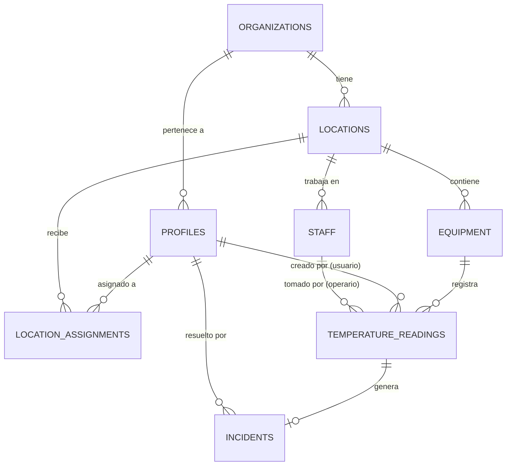

# Estructura y Arquitectura de Base de Datos - TempMonitor V1

Este documento detalla el diseño físico del esquema de base de datos en Supabase (PostgreSQL) para **TempMonitor V1**, explicando la estructura de las tablas, sus relaciones y las razones de diseño detrás de cada una de ellas para soportar un modelo SaaS B2B Multi-Tenant offline-first y cumplimiento normativo sanitario.

---

## 🗺️ Diagrama de Relaciones (Estructura de Tablas)

A continuación se muestra cómo se relacionan las 8 tablas principales de la base de datos:

---

## 🗂️ Detalle de Tablas y Columnas

### 1. `organizations` (Empresas / Tenants)

Representa al cliente B2B (Tenant) que contrata el servicio.

- **`id`** (`UUID`, PRIMARY KEY): Identificador único de la organización.
- **`name`** (`TEXT`, NOT NULL): Nombre legal o de fantasía de la empresa.
- **`business_type`** (`TEXT`): Rubro de negocio. Restringido por check constraint a: `'restaurant'`, `'pharmacy'`, `'butcher_shop'`, `'supermarket'`, `'general'`.
- **`status`** (`TEXT`): Estado de la cuenta. Valores: `'active'`, `'paused'`, `'suspended'`.
- **`plan_type`** (`TEXT`): Plan contratado: `'basic'`, `'pro'`, `'enterprise'`.
- **`max_locations`** (`INTEGER`, DEFAULT 1): Límite físico de sucursales según plan.
- **`created_by`** (`UUID`): Usuario creador.
- **`created_at`** (`TIMESTAMPTZ`): Fecha de registro de la organización.

### 2. `profiles` (Perfiles de Usuario)

Metadatos y rol de seguridad vinculados a las credenciales de `auth.users` de Supabase.

- **`id`** (`UUID`, PRIMARY KEY, FK -> `auth.users`): Mapeado directo 1:1 con el usuario autenticado.
- **`email`** (`TEXT`, NOT NULL): Correo electrónico del usuario.
- **`full_name`** (`TEXT`): Nombre completo.
- **`organization_id`** (`UUID`, FK -> `organizations`): Tenant al que pertenece.
- **`role`** (`TEXT`): Rol RBAC del usuario. Valores: `'owner'`, `'admin'`, `'manager'`, `'staff'`.
- **`is_platform_admin`** (`BOOLEAN`, DEFAULT false): Flag para administradores globales de la plataforma SaaS.
- **`created_at`** (`TIMESTAMPTZ`): Fecha de creación del perfil.

### 3. `locations` (Sedes / Sucursales)

Las sedes físicas del cliente (ej. "Sede Centro", "Sucursal Providencia").

- **`id`** (`UUID`, PRIMARY KEY): Identificador de la sucursal.
- **`organization_id`** (`UUID`, FK -> `organizations`): Organización dueña.
- **`name`** (`TEXT`, NOT NULL): Nombre de la sucursal.
- **`address`** (`TEXT`): Dirección física.
- **`created_at`** (`TIMESTAMPTZ`): Fecha de registro.

### 4. `location_assignments` (Asignaciones de Personal)

Asocia a usuarios de tipo `manager` o `staff` a sedes específicas (control de visibilidad local).

- **`id`** (`UUID`, PRIMARY KEY)
- **`user_id`** (`UUID`, FK -> `profiles`)
- **`location_id`** (`UUID`, FK -> `locations`)
- **`role`** (`TEXT`): Rol en esta sede específica. Valores: `'manager'`, `'staff'`.
- **`created_at`** (`TIMESTAMPTZ`)
- _Restricción:_ Llave única compuesta en `(user_id, location_id)` para evitar asignaciones duplicadas.

### 5. `equipment` (Equipos de Frío)

Dispositivos que requieren monitoreo térmico (ej. conservadoras, vitrinas, cámaras).

- **`id`** (`UUID`, PRIMARY KEY)
- **`location_id`** (`UUID`, FK -> `locations`): Sede física donde está instalado.
- **`name`** (`TEXT`, NOT NULL): Nombre descriptivo (ej. "Nevera Lacteos 1").
- **`physical_location`** (`TEXT`, nullable): Área física dentro de la sede donde está instalado el equipo (ej. "Cocina principal", "Bodega fría", "Área de farmacia"). Distinto de `location_id` (que identifica la sede completa) — permite distinguir equipos dentro de una misma sede grande. _(Agregada vía migración TASK-001b)_
- **`code`** (`TEXT`, UNIQUE): Código inventario/ISP (ej. "REF-03").
- **`min_temp`** (`DECIMAL`, NOT NULL): Límite mínimo de temperatura permitido.
- **`max_temp`** (`DECIMAL`, NOT NULL): Límite máximo de temperatura permitido.
- **`is_iot_enabled`** (`BOOLEAN`, DEFAULT false): Indica si el equipo tiene un sensor automático.
- **`iot_device_id`** (`TEXT`, UNIQUE): Identificador del hardware/sensor de IoT.
- **`created_at`** (`TIMESTAMPTZ`)

### 6. `staff` (Colaboradores Operativos)

Personal de turno que toma registros manuales (cocineros, operarios de bodega) pero que no necesitan cuenta de usuario ni login en la plataforma.

- **`id`** (`UUID`, PRIMARY KEY)
- **`location_id`** (`UUID`, FK -> `locations`): Sede de trabajo.
- **`name`** (`TEXT`, NOT NULL): Nombre completo del colaborador.
- **`role`** (`TEXT`, NOT NULL): Puesto (ej. "Cocinero", "Auxiliar").
- **`active`** (`BOOLEAN`, DEFAULT true): Estado operativo.
- **`created_at`** y **`updated_at`** (`TIMESTAMPTZ`)

### 7. `temperature_readings` (Historial de Mediciones)

Almacena las mediciones de temperatura enviadas manualmente por la PWA o automáticamente por dispositivos IoT.

- **`id`** (`UUID`, PRIMARY KEY)
- **`equipment_id`** (`UUID`, FK -> `equipment`): Equipo medido.
- **`value`** (`DECIMAL`, NOT NULL): Valor térmico registrado en grados Celsius.
- **`reading_type`** (`TEXT`, DEFAULT 'manual'): Origen de la lectura. Valores: `'manual'` o `'iot'`.
- **`sensor_battery`** y **`sensor_signal`**: Métricas de diagnóstico de hardware para telemetría IoT.
- **`snapshot_min_temp`** y **`snapshot_max_temp`** (`DECIMAL`): Copias del rango de seguridad configurado en el equipo al momento de la lectura (Esencial para auditorías sanitarias e integridad histórica).
- **`recorded_by_profile`** (`UUID`, FK -> `profiles`): ID del usuario del sistema si fue digitalizado directamente.
- **`recorded_by_staff`** (`UUID`, FK -> `staff`): ID del colaborador en turno si fue anotado en papel y digitalizado por lote.
- **`taken_by`** (`TEXT`): Nombre del operario que tomó la medición (para visualización directa rápida sin JOINs pesados).
- **`recorded_at`** (`TIMESTAMPTZ`, DEFAULT now())

### 8. `incidents` (Incidentes y Alertas de Desviación)

Registra desviaciones críticas de temperatura (cuando la lectura está fuera del rango seguro del equipo).

- **`id`** (`UUID`, PRIMARY KEY)
- **`reading_id`** (`UUID`, FK -> `temperature_readings`): Lectura que gatilló la alerta.
- **`status`** (`TEXT`, DEFAULT 'open'): Estado de resolución. Valores: `'open'` o `'resolved'`.
- **`description`** (`TEXT`, NOT NULL): Detalle de la anomalía (ej: "Temperatura de 12°C supera límite máximo de 8°C").
- **`action_taken`** (`TEXT`): Acción correctiva aplicada bajo normas HACCP (ej. "Se trasladaron las vacunas a cámara de respaldo y se llamó a técnico").
- **`resolved_by`** (`UUID`, FK -> `profiles`): Usuario administrador que resolvió y cerró la desviación.
- **`resolved_at`** (`TIMESTAMPTZ`): Fecha y hora del cierre del incidente.
- **`created_at`** (`TIMESTAMPTZ`, DEFAULT now())

---

## 🧠 Explicación Arquitectónica: El "Por Qué" del Diseño

### 1. Aislamiento Multi-Tenant (B2B SaaS)

- **Por qué:** Para vender esta plataforma a múltiples empresas resguardando la privacidad de sus datos, la tabla `organizations` actúa como la frontera lógica superior.
- **Cómo:** Los usuarios (`profiles`) y las sedes (`locations`) heredan y se filtran mediante `organization_id`. Las políticas de seguridad (RLS) en Postgres aseguran que un usuario de la "Empresa A" sea físicamente incapaz de ver, alterar o inyectar registros en las sedes o equipos de la "Empresa B".

### 2. Resiliencia de Auditoría mediante Desnormalización (`Snapshots`)

- **Por qué:** Si hoy un equipo de frío tiene un rango seguro de `2°C a 8°C`, y un inspector de salud revisa lecturas del año pasado cuando el equipo estaba configurado de `1°C a 5°C`, cambiar los límites del equipo hoy alteraría retroactivamente los reportes del año pasado si dependiéramos de un `JOIN` dinámico.
- **Cómo:** Almacenamos `snapshot_min_temp` y `snapshot_max_temp` directamente en cada registro de la tabla `temperature_readings`. Esto congela los límites regulatorios que regían en ese preciso instante de tiempo, asegurando validez jurídica y científica frente a reguladores sanitarios (HACCP / ISP en Chile).

### 3. Registro Offline-First y personal sin login (`staff`)

- **Por qué:** En zonas críticas como cámaras subterráneas de congelación, no hay internet ni es práctico que cada cocinero o bodeguero cree una cuenta con correo y contraseña. Muchos registran en hojas de papel que luego se digitalizan al final del día.
- **Cómo:** Separamos a los usuarios con cuenta y login (`profiles`) de los operarios de planta (`staff`). La tabla `temperature_readings` permite opcionalmente ligar una medición a un perfil del sistema (`recorded_by_profile`) o a un operario local (`recorded_by_staff`), guardando además en texto plano (`taken_by`) quién ejecutó la medición para acelerar consultas.

### 4. Ciclo de Acción Correctiva HACCP / ISP

- **Por qué:** Las normativas de seguridad alimentaria y farmacéutica exigen que si la cadena de frío se rompe, **debe existir un registro auditable de la acción correctiva tomada**. No basta con registrar que falló.
- **Cómo:** La tabla `incidents` está vinculada a una lectura fuera de rango. Requiere obligatoriamente completar los campos `action_taken` (acción correctiva), `resolved_by` (firma digital del responsable) y `resolved_at` (tiempo de corrección) para poder cerrar el ticket, cumpliendo estrictamente el ciclo cerrado de fiscalización.

### 5. Control de Límites Automático mediante Trigger

- **Por qué:** Impedir que usuarios en planes básicos creen sedes infinitas abusando de los recursos de la API.
- **Cómo:** La lógica se delega a la base de datos a través de una función y trigger `check_location_limit()` en la base de datos. Se ejecuta a nivel de motor de BD antes del `INSERT`, garantizando el cumplimiento del modelo de negocio de manera segura y centralizada.

### 6. Arquitectura e Integración IoT (Monitoreo Automatizado 24/7)

- **Por qué:** El monitoreo manual tradicional es propenso a errores humanos, olvidos y falsificación de registros. Para garantizar mediciones constantes durante las 24 horas del día (incluyendo noches y fines de semana sin personal), se requiere un canal de telemetría IoT automatizado que registre temperatura de forma autónoma.
- **Cómo:**
  - **Enlace de Hardware:** La tabla `equipment` mapea la relación física a través de las columnas `is_iot_enabled` (activador del canal) y `iot_device_id` (código de barra/dirección física MAC única del sensor físico).
  - **Telemetría y Diagnóstico:** Las lecturas ingresadas bajo este flujo marcan `reading_type = 'iot'`, registrando además telemetría diagnóstica del dispositivo físico en `sensor_battery` (para alertar sobre cambio de baterías preventivo) y `sensor_signal` (fuerza de señal RSSI en dBm para diagnosticar fallas de cobertura inalámbrica en bodegas metálicas o refrigeradores con mucho aislamiento).
  - **Simulador Local por Software:** Para pruebas locales y demostraciones B2B sin hardware físico conectado, el frontend incorpora un simulador en segundo plano (`useIotSimulator.ts`) que inyecta telemetría simulada periódicamente a la base de datos de Supabase imitando el comportamiento de sensores de hardware reales.
